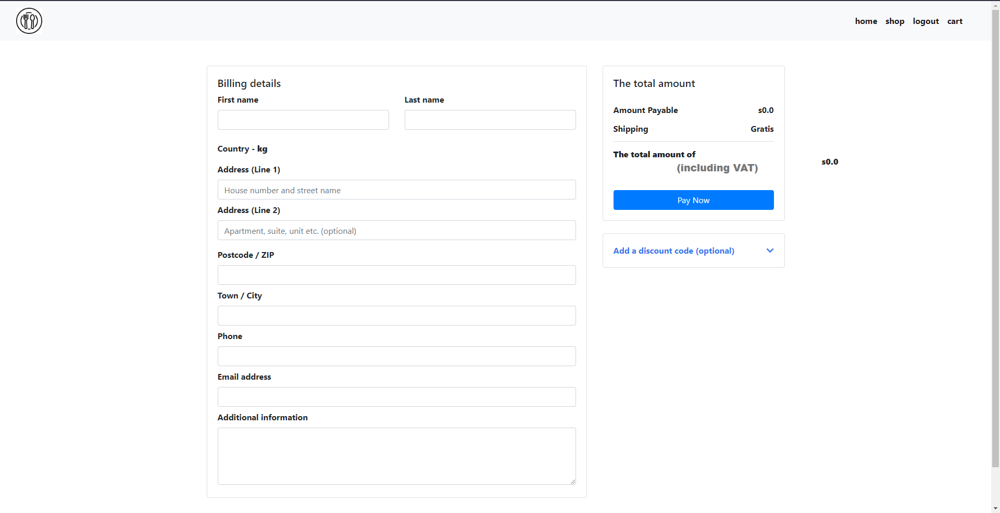

# storeApp
 java

hello every one

you can look at the screenshots or enter the web-site
---
    swagger-ui.html
---





```properties

spring_profiles_active=prod
PROD_DB_HOST=containers-us-west-154.railway.app
PROD_DB_PORT=7745
PROD_DB_NAME=railway
PROD_DB_USERNAME=postgres
PROD_DB_PASSWORD=X8vETRpyvPSairagTQh1
```